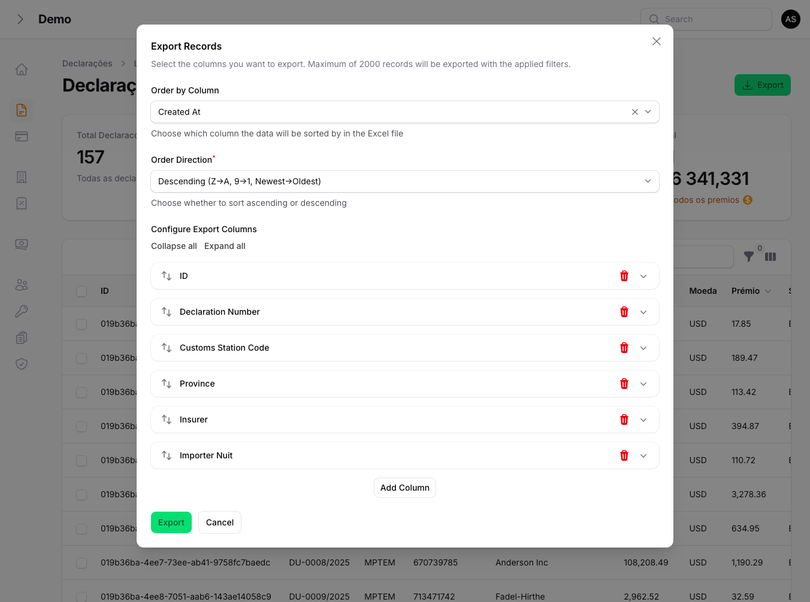

# Filament Advanced Export

[](https://packagist.org/packages/filamentphp/advanced-export)
[](https://packagist.org/packages/filamentphp/advanced-export)
[](https://packagist.org/packages/filamentphp/advanced-export)

Advanced export functionality for Filament resources with dynamic column selection, filtering, ordering, and background processing.

## Features

- **One-Command Setup** - Configure export for any resource with a single command
- **Dynamic Column Selection** - Users choose which columns to export
- **Custom Column Titles** - Rename columns in the exported file
- **XLSX and CSV Formats** - Export in Excel or CSV format via modal selector
- **Record Count Preview** - See how many records will be exported before exporting
- **Configurable Ordering** - Sort by any column with validated input (ascending or descending)
- **Automatic Filter Support** - Automatically respects active Filament table filters
- **Configurable Fallback Filters** - Override fallback filter names per resource or via config
- **Background Processing** - Queue large exports for async processing
- **Secure Error Handling** - Generic user notifications, detailed internal logging
- **View-Based Templates** - Customizable Blade views for export formatting
- **FilamentShield Integration** - Per-resource export permissions (Export:Titular, etc.)
- **Bilingual Support** - English and Portuguese translations included
- **Artisan Commands** - Generate views and model methods automatically

## Requirements

- PHP 8.2+
- Laravel 11.0+, 12.0+ or 13.0+
- Filament 4.0+ or 5.0+
- Maatwebsite Excel 3.1+ or 4.0+

## Installation

Install the package via Composer:

```bash
composer require filamentphp/advanced-export
```

Run the installation command:

```bash
php artisan export:install
```

This will:
- Publish the configuration file
- Publish translation files
- Register the plugin in your panel (interactive)

### Manual Configuration

If you prefer manual setup, publish assets individually:

```bash
# Publish configuration
php artisan export:publish --config

# Publish views
php artisan export:publish --views

# Publish translations
php artisan export:publish --lang

# Publish stubs
php artisan export:publish --stubs

# Publish everything
php artisan export:publish --all
```

## Quick Start

### Option 1: One-Command Setup (Recommended)

The fastest way to add export functionality to any Filament resource:

```bash
php artisan export:resource "App\Filament\Resources\ClienteResource"
```

This single command will:
1. **Configure the Model** - Add `Exportable` interface, trait, and export methods
2. **Generate Views** - Create both simple and advanced export Blade templates
3. **Update ListRecords** - Add the `HasAdvancedExport` trait and export action

That's it! Your resource now has full export functionality.

#### Options

```bash
# Force overwrite existing files
php artisan export:resource "App\Filament\Resources\ClienteResource" --force
```

### Option 2: Step-by-Step Setup

If you prefer more control, you can set up each component individually:

#### 1. Configure the Model

```bash
php artisan export:model App\\Models\\Cliente
```

Or manually add the interface and methods:

```php
<?php

namespace App\Models;

use Filament\AdvancedExport\Contracts\Exportable;
use Filament\AdvancedExport\Traits\InteractsWithExportable;
use Illuminate\Database\Eloquent\Model;

class Cliente extends Model implements Exportable
{
    use InteractsWithExportable;

    public static function getExportColumns(): array
    {
        return [
            'id' => 'ID',
            'nome' => 'Name',
            'email' => 'Email',
            'telefone' => 'Phone',
            'status' => 'Status',
            'created_at' => 'Created At',
        ];
    }

    public static function getDefaultExportColumns(): array
    {
        return [
            ['field' => 'id', 'title' => 'ID'],
            ['field' => 'nome', 'title' => 'Full Name'],
            ['field' => 'email', 'title' => 'Email Address'],
            ['field' => 'status', 'title' => 'Status'],
        ];
    }
}
```

#### 2. Generate Export Views

```bash
php artisan export:views App\\Models\\Cliente
```

This creates:
- `resources/views/exports/clientes-excel.blade.php` (simple export)
- `resources/views/exports/clientes-excel-advanced.blade.php` (advanced export)

#### 3. Add Trait to ListRecords

```php
<?php

namespace App\Filament\Resources\Cliente\Pages;

use App\Filament\Resources\ClienteResource;
use Filament\AdvancedExport\Traits\HasAdvancedExport;
use Filament\Actions\CreateAction;
use Filament\Resources\Pages\ListRecords;

class ListClientes extends ListRecords
{
    use HasAdvancedExport;

    protected static string $resource = ClienteResource::class;

    protected function getHeaderActions(): array
    {
        return [
            $this->getAdvancedExportHeaderAction(),
            CreateAction::make(),
        ];
    }
}
```

## Automatic Filter Support

One of the key features of this package is **automatic filter support**. When users apply filters to your Filament table (e.g., `?filters[status][values][0]=pending`), the export will automatically respect those filters.

### How It Works

The package automatically:
1. Extracts all active filters from the Filament table
2. Checks if the filter column exists in the database table
3. Applies the appropriate `WHERE` or `WHERE IN` clause

### Supported Filter Types

| Filter Type | Example URL | Query Applied |
|-------------|-------------|---------------|
| Single value | `?filters[status][value]=active` | `WHERE status = 'active'` |
| Multiple values | `?filters[status][values][0]=pending&filters[status][values][1]=active` | `WHERE status IN ('pending', 'active')` |
| Date range | `?filters[created_at][from]=2024-01-01&filters[created_at][until]=2024-12-31` | `WHERE created_at BETWEEN ...` |

### Custom Filter Handling

For complex filters that don't map directly to columns, override the `applyCustomFilter` method:

```php
class ListClientes extends ListRecords
{
    use HasAdvancedExport;

    protected function applyCustomFilter($query, string $filterName, mixed $filterValue): void
    {
        match ($filterName) {
            'has_orders' => $query->whereHas('orders'),
            'premium_customer' => $query->where('total_spent', '>', 10000),
            default => $this->applyGenericFilter($query, $filterName, $filterValue),
        };
    }
}
```

## Configuration

The configuration file is published to `config/advanced-export.php`:

```php
return [
    // Export limits
    'limits' => [
        'max_records' => 2000,
        'chunk_size' => 500,
        'queue_threshold' => 2000,
    ],

    // View configuration
    'views' => [
        'path' => 'exports',
        'simple_suffix' => '-excel',
        'advanced_suffix' => '-excel-advanced',
        'use_package_views' => false,
    ],

    // Date formatting
    'date_format' => 'd/m/Y H:i',

    // File generation
    'file' => [
        'extension' => 'xlsx',       // Default format: 'xlsx' or 'csv'
        'disk' => 'public',
        'directory' => 'exports',
        'supported_formats' => ['xlsx', 'csv'],  // Formats shown in modal
    ],

    // Action button appearance
    'action' => [
        'name' => 'export',
        'label' => null,
        'icon' => 'heroicon-o-arrow-down-tray',
        'color' => 'success',
    ],

    // Fallback filters (used when dynamic extraction fails)
    'fallback_filters' => [
        'created_at',
        'updated_at',
    ],

    // Queue settings
    'queue' => [
        'enabled' => true,
        'connection' => 'default',
        'queue' => 'exports',
    ],
];
```

## CSV Export

The export modal includes a format selector. Users can choose between XLSX and CSV:

```php
// config/advanced-export.php
'file' => [
    'extension' => 'xlsx',                    // Default format
    'supported_formats' => ['xlsx', 'csv'],   // Available in modal
],
```

CSV exports use the `CsvExport` class which implements `FromCollection` and `WithHeadings` for clean tabular output without view templates.

## Record Count Preview

The export modal shows how many records will be exported before the user clicks the export button. This count respects active filters and the configured maximum limit.

## Fallback Filter Configuration

When dynamic filter extraction fails (e.g., non-standard table implementations), the package falls back to a configurable list of filter names:

```php
// config/advanced-export.php
'fallback_filters' => [
    'created_at',
    'updated_at',
    // Add your resource-specific filters here
],
```

You can also override per-resource:

```php
class ListClientes extends ListRecords
{
    use HasAdvancedExport;

    protected function getFallbackFilterNames(): array
    {
        return ['created_at', 'updated_at', 'status', 'cliente_id'];
    }
}
```

## Security

### Error Handling

Export errors show a generic message to the user and log the full error internally:

- **User sees:** "An error occurred while processing the export. Please try again or contact support."
- **Logs contain:** Full exception message, stack trace, and context

### Input Validation

- **Order column** is validated against the database schema and export columns list
- **Order direction** only accepts `asc` or `desc` (case-insensitive), invalid values fall back to `desc`
- **Dot notation columns** (e.g., `client.name`) are skipped gracefully in ordering -- override `applyCustomOrdering()` to handle them with joins

## Screenshots

### Export Modal


## Advanced Usage

### Relationship Columns

You can export relationship data simply by using the relationship name as the column key:

```php
public static function getExportColumns(): array
{
    return [
        'id' => 'ID',
        'declaration_number' => 'Declaration Number',
        'insurer' => 'Insurer',  // Will automatically load the relationship
        'status' => 'Status',
    ];
}
```

The package will automatically detect and load the relationship, displaying the related model's default display value.

For more specific relationship data (like a specific attribute), use dot notation:

```php
public static function getExportColumns(): array
{
    return [
        'id' => 'ID',
        'insurer.name' => 'Insurer Name',      // Specific attribute
        'insurer.nuit' => 'Insurer NUIT',      // Another attribute
        'status' => 'Status',
    ];
}
```

### Eager Loading Relationships

To optimize performance, specify relationships to eager load:

```php
class ListDeclarations extends ListRecords
{
    use HasAdvancedExport;

    protected function getExportRelationshipsForModel(): array
    {
        return ['insurer', 'payments', 'createdBy'];
    }
}
```

### Custom Ordering

The package validates order columns and directions automatically. Dot notation columns (relationship paths) are skipped by default.

To handle ordering by relationship columns, override `applyCustomOrdering()`:

```php
class ListClientes extends ListRecords
{
    use HasAdvancedExport;

    protected function applyCustomOrdering($query, string $orderColumn, string $orderDirection): void
    {
        // Direction is already validated ('asc' or 'desc') at this point
        if ($orderColumn === 'insurer.name') {
            $query->join('insurers', 'declarations.insurer_id', '=', 'insurers.id')
                  ->orderBy('insurers.name', $orderDirection);
            return;
        }

        // Call parent for standard column validation and ordering
        parent::applyCustomOrdering($query, $orderColumn, $orderDirection);
    }
}
```

### Using Package Default Views

If you don't want to create custom views for each model:

```php
// config/advanced-export.php
'views' => [
    'use_package_views' => true,
],
```

## Artisan Commands

### `export:resource` (Recommended)

Complete setup for a Filament resource in one command:

```bash
# Basic usage
php artisan export:resource "App\Filament\Resources\ClienteResource"

# Force overwrite existing files
php artisan export:resource "App\Filament\Resources\ClienteResource" --force
```

This command:
- Detects the model from the resource's `$model` property
- Finds the ListRecords page from `getPages()`
- Runs `export:model` to configure the model
- Runs `export:views` to generate Blade templates
- Updates the ListRecords page with the trait and action

### `export:install`

Initial package setup:

```bash
php artisan export:install
php artisan export:install --panel=admin
php artisan export:install --no-interaction
```

### `export:model`

Add export methods to a model:

```bash
php artisan export:model App\\Models\\Cliente
php artisan export:model App\\Models\\Cliente --columns=id,nome,email,created_at
php artisan export:model App\\Models\\Cliente --force
```

### `export:views`

Generate export views for a model:

```bash
php artisan export:views App\\Models\\Cliente
php artisan export:views App\\Models\\Cliente --force
```

### `export:publish`

Publish package assets:

```bash
php artisan export:publish --config
php artisan export:publish --views
php artisan export:publish --stubs
php artisan export:publish --lang
php artisan export:publish --migrations
php artisan export:publish --all
php artisan export:publish --all --force
```

## Translations

The package includes translations for:
- English (`en`)
- Portuguese (`pt`)

To add more languages, publish the translations and create new language files:

```bash
php artisan export:publish --lang
```

Then create `resources/lang/vendor/advanced-export/{locale}/messages.php`.

## Background Processing with Notifications

The package includes a powerful background export feature with automatic database notifications. This is ideal for large exports that would otherwise timeout.

### Using Background Export Action

Add the background export action to your ListRecords page:

```php
use Filament\AdvancedExport\Traits\HasAdvancedExport;

class ListDeclarations extends ListRecords
{
    use HasAdvancedExport;

    protected function getHeaderActions(): array
    {
        return [
            $this->getAdvancedExportHeaderAction(),      // Synchronous export
            $this->getBackgroundExportAction(),          // Background export with notifications
            CreateAction::make(),
        ];
    }
}
```

### How It Works

1. User clicks "Background Export" button
2. A confirmation modal appears
3. Upon confirmation, `ProcessExportJob` is dispatched to the queue
4. User sees a notification that the export is being processed
5. When complete, a **database notification** appears with a download link
6. If the export fails, a failure notification is sent

### Requirements for Database Notifications

Make sure your Filament panel has database notifications enabled:

```php
// app/Providers/Filament/AdminPanelProvider.php
public function panel(Panel $panel): Panel
{
    return $panel
        ->default()
        ->id('admin')
        ->databaseNotifications()  // Enable this!
        // ...
}
```

### Running the Queue Workers

Background exports require queue workers. Run both the exports queue and the default queue (for notifications):

```bash
# In separate terminals or using a process manager like Supervisor:
php artisan queue:work --queue=exports
php artisan queue:work --queue=default
```

Or use a single worker for both:

```bash
php artisan queue:work --queue=exports,default
```

### Dispatching Exports Programmatically

You can also dispatch exports directly:

```php
use Filament\AdvancedExport\Jobs\ProcessExportJob;

ProcessExportJob::dispatch(
    modelClass: Cliente::class,
    filters: $activeFilters,
    fileName: 'clientes_export_2024.xlsx',
    viewName: 'exports.clientes-excel-advanced',
    columnsConfig: $columnsConfig,
    orderColumn: 'created_at',
    orderDirection: 'desc',
    relationships: ['tipoCliente', 'provincia'],
    userId: auth()->id()  // Required for notifications
);
```

### Configuring the User Model

If you use a custom user model, configure it in `config/advanced-export.php`:

```php
'user_model' => App\Models\User::class,
```

### Filter Support in Background Exports

Background exports fully support all filter types:

| Filter Type | Automatically Handled |
|-------------|----------------------|
| Direct columns | `status`, `type` |
| Relationship filters | `insurer` → `insurer_id` |
| Date ranges | `created_at[from/until]` |
| Multiple values | `status[values][0,1,2]` |

The `ProcessExportJob` automatically resolves relationship filter names to their actual column names (e.g., `insurer` → `insurer_id`).

## Customizing Blade Views

The package uses Blade views to render Excel exports. You can customize these views to format data, add styling, or handle special fields.

### View Types

| Type | Generated File | Purpose |
|------|----------------|---------|
| Simple | `{table}-excel.blade.php` | Exports all model attributes automatically |
| Advanced | `{table}-excel-advanced.blade.php` | Exports only user-selected columns with custom titles |

### View Variables

Both views receive these variables:

| Variable | Type | Description |
|----------|------|-------------|
| `${tableName}` | Collection | The records to export (e.g., `$declarations`) |
| `$columnsConfig` | array | User-selected columns with titles (advanced only) |

### Basic View Structure

```blade
@php use Carbon\Carbon; @endphp
<table>
    <thead>
    <tr>
        @foreach($columnsConfig as $columnConfig)
            <th>{{ $columnConfig['title'] ?? 'Untitled' }}</th>
        @endforeach
    </tr>
    </thead>
    <tbody>
    @foreach($declarations as $declaration)
        <tr>
            @foreach($columnsConfig as $columnConfig)
                @php $field = $columnConfig['field'] ?? ''; @endphp
                <td>
                    @switch($field)
                        {{-- Custom field handling here --}}
                        @default
                            {{ $declaration->{$field} ?? '-' }}
                    @endswitch
                </td>
            @endforeach
        </tr>
    @endforeach
    </tbody>
</table>
```

### Custom Field Formatting

Use `@switch` statements to format specific fields:

```blade
@switch($field)
    {{-- Date formatting --}}
    @case('created_at')
        {{ $record->created_at?->format('d/m/Y H:i') ?? '-' }}
        @break

    {{-- Relationship data --}}
    @case('insurer')
        {{ $record->insurer->name ?? '-' }}
        @break

    {{-- Currency formatting --}}
    @case('amount')
        {{ number_format($record->amount, 2, ',', '.') }}
        @break

    {{-- Boolean values --}}
    @case('is_active')
        {{ $record->is_active ? 'Yes' : 'No' }}
        @break

    {{-- Enum/Status with translation --}}
    @case('status')
        {{ __("statuses.{$record->status}") }}
        @break

    {{-- Nested relationships --}}
    @case('client.province')
        {{ $record->client?->province?->name ?? '-' }}
        @break

    @default
        {{ $record->{$field} ?? '-' }}
@endswitch
```

### Complete Custom View Example

Here's a full example for a `declarations` export:

```blade
{{-- resources/views/exports/declarations-excel-advanced.blade.php --}}
@php use Carbon\Carbon; @endphp
<table>
    <thead>
    <tr>
        @foreach($columnsConfig as $columnConfig)
            <th>{{ $columnConfig['title'] ?? __('advanced-export::messages.undefined_title') }}</th>
        @endforeach
    </tr>
    </thead>
    <tbody>
    @foreach($declarations as $declaration)
        <tr>
            @foreach($columnsConfig as $columnConfig)
                @php $field = $columnConfig['field'] ?? ''; @endphp
                <td>
                    @switch($field)
                        @case('id')
                            {{ $declaration->id ?? '-' }}
                            @break
                        @case('declaration_number')
                            {{ $declaration->declaration_number ?? '-' }}
                            @break
                        @case('insurer')
                            {{ $declaration->insurer->name ?? '-' }}
                            @break
                        @case('cif_value')
                            {{ number_format($declaration->cif_value ?? 0, 2, ',', '.') }}
                            @break
                        @case('status')
                            {{ ucfirst($declaration->status ?? '-') }}
                            @break
                        @case('created_at')
                            {{ $declaration->created_at?->format('d/m/Y H:i') ?? '-' }}
                            @break
                        @default
                            {{ $declaration->{$field} ?? '-' }}
                    @endswitch
                </td>
            @endforeach
        </tr>
    @endforeach
    </tbody>
</table>
```

### Using Package Default Views

If you don't need custom formatting, enable the package's default views:

```php
// config/advanced-export.php
'views' => [
    'use_package_views' => true,
],
```

The default views automatically:
- Format dates using `config('advanced-export.date_format')`
- Handle null values with `-`
- Convert booleans to Yes/No
- Serialize arrays/objects to JSON

### Styling Excel Output

Maatwebsite Excel supports basic HTML styling:

```blade
<table>
    <thead>
    <tr style="background-color: #4CAF50; color: white; font-weight: bold;">
        @foreach($columnsConfig as $columnConfig)
            <th>{{ $columnConfig['title'] }}</th>
        @endforeach
    </tr>
    </thead>
    <tbody>
    @foreach($records as $record)
        <tr style="{{ $loop->even ? 'background-color: #f2f2f2;' : '' }}">
            {{-- cells --}}
        </tr>
    @endforeach
    </tbody>
</table>
```

## Customizing the Export Button

Override trait methods to customize appearance:

```php
class ListClientes extends ListRecords
{
    use HasAdvancedExport;

    protected function getExportActionLabel(): string
    {
        return 'Download Excel';
    }

    protected function getExportActionIcon(): string
    {
        return 'heroicon-o-document-arrow-down';
    }

    protected function getExportActionColor(): string
    {
        return 'primary';
    }

    protected function getExportModalHeading(): string
    {
        return 'Configure Your Export';
    }
}
```

## FilamentShield Integration

If you use [FilamentShield](https://filamentphp.com/plugins/bezhansalleh-shield), the export button can be controlled per role/resource.

### Step 1: Add the trait to your Resource

```php
use Filament\AdvancedExport\Concerns\HasExportPermission;

class TitularResource extends Resource
{
    use HasExportPermission;
    // ...
}
```

This registers `export` as a permission prefix. When you run `php artisan shield:generate`, Shield will create `Export:Titular` automatically.

### Step 2: That's it!

The export button will only be visible to users with the `Export:{Resource}` permission. Without Shield installed, the button is visible to everyone.

### How it works

- `HasExportPermission` trait on the **Resource** → tells Shield to generate the `export` permission
- `HasAdvancedExport` trait on the **ListRecords** → checks if user has the permission before showing the button
- Without Shield → export is always allowed (no breaking changes)

## Changelog

Please see [CHANGELOG](CHANGELOG.md) for more information on what has changed recently.

## Contributing

Contributions are welcome! Please see [CONTRIBUTING](CONTRIBUTING.md) for details.

## Security

If you discover any security-related issues, please email anselmokossa.apk@gmail.com instead of using the issue tracker.

## Credits

- [Anselmo Kossa](https://github.com/anselmokossa)
- [All Contributors](../../contributors)

## License

The MIT License (MIT). Please see [License File](LICENSE.md) for more information.
